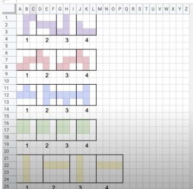
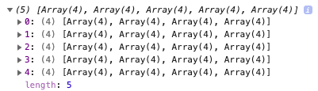
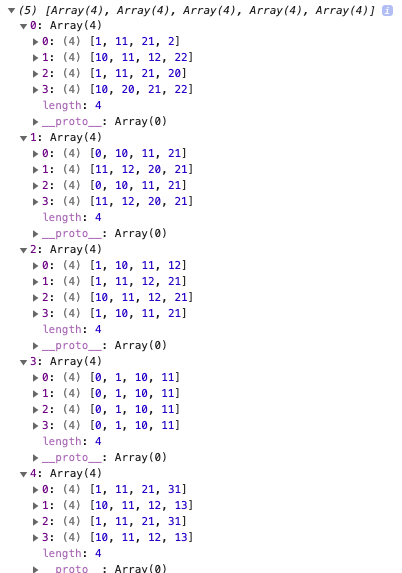
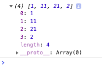

# Basic JavaScript Tetris game

### What is this about?

"Learn the basics of JavaScript by coding a Tetris game from scratch."

### This Repo is based on:

- Freecodecamp YouTube video: [Code Tetris: JavaScript Tutorial for Beginners](https://www.youtube.com/watch?v=rAUn1Lom6dw), also see [Tetris Basic on GitHub](https://github.com/kubowania/Tetris-Basic) to this
- originally found here: [FreeCodeCamp article](https://www.freecodecamp.org/news/learn-javascript-by-creating-a-tetris-game/)

### How to run this?

- clone this repo
- cd into project
- simply open the `index.html` in your browser of choice (in my case, built in/for Chrome), as the project files are not bundled / do not run with any `run` command

### How to play the game?

- start the game in clicking the Start/Pause button
- use arrow keys to navigate
  - Arrow left = move left
  - Arrow right = move right
  - Arrow down = move down
  - Arrow up = turn clockwise
- the little beige box on the right will show you the next Tetromino falling

### YouTube video Content

- Introduction
- Setting up the project
- HTML Basics
- CSS Basics
- Explaining Variables
- Working with Arrays
- What exactly is a function?
- Arrow Functions and `forEach()`
- Drawing Tetrominos using `classList.add()`
- Times and intervals
- Using Modulus to define our place on the grid
- Keycodes and events
- Choosing items from Arrays
- Displaying the 'Next Up' Tetromino
- Adding a start and pause game function
- `Splice()`
- `Splice()`, `concat()` and `appendChild()`
- Game over using `some()` and `innerHTML`
- Assigning colors to our Tetrominos

### Here are some of the JavaScript methods used in the YouTube video course:

`addEventListener()`
`querySelector()`
`querySelectorAll()`
`keyCode()`
`Math.floor()`
`Math.random()`
`length`
`forEach()`
`splice()`
`clearInterval()`
`setInterval()`
`some()`
`innerHTML()`
`every()`
`add()`
`remove()`
`contains()`

### General info

- Game is based on a grid, 20 squares tall and 10 squares wide
- As this makes 200 `
s` I've installed [Emmet](https://plugins.jetbrains.com/plugin/7450-emmet-everywhere) to not create all of them manually.
  

### Rendered Tetromino Arrays

See screenshots below for better understanding what is happening in `app.js`, from line 23 on.

All Tetrominos - lTetromino, zTetromino, tTetromino, oTetromino, iTetromino

All Tetrominos - lTetromino, zTetromino, tTetromino, oTetromino, iTetromino

lTetromino

### Personal Expectation Management towards the video course

- coding JavaScript
- short (time constraints)
- easy to code along
- quick to get done
- based on everything I've encountered on freecodecamp by now, which was mostly very valuable, so when I got this suggestion handed in and saw the length of the course I decided to go for it

### PRO

- short-ish course
- easy to code along
- after finishing, the desire to clean up this mess (which I did not do as I want to do something new)

### CON

"This is a great course for people who have never touched code before or people who want to review the fundamentals."

- I would never recommend this to someone who has never touched code or has never JavaScript before, as they would not learn anything
- if you look at the content of the course and take into consideration that the course length is 1:36:07 - you quickly figure out yourself that they are rushing through parts and do not explain thoroughly
- this also lead to a common use case that in reality, you take way longer that the proclaimed period of watch time
- accent of tutor: "Tetromino" = not even YouTube's CC was working, so there you get "otra Mina", "touch arena" or even "El techno me know" due to the extreme accent

### CON technically

- not responsive
- naming
- implicitly declaring variables in course
- not using spaces, brackets, parenthesis, quotes, backticks, semicolons properly/consistently
- `keyCode` event is deprecated - video is from May 2020, so that's sub optimal to say the least
- generally some code seems messy for the sake of showing quick results
