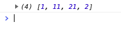

# WIP - Basic JavaScript Tetris Game - Freecodecamp course
Learn the basics of JavaScript by coding a Tetris game from scratch.
IDE Atom used in the tutorial video for this (I used PhpStorm).  

## Course / Video Contents
- Introduction  
- Setting up the project  
- HTML Basics  
- CSS Basics  
- Explaining Variables  
- Working with Arrays  
- What exactly is a function?  
- Arrow Functions and `forEach()`  
- Drawing Tetrominos using `classList.add()`  
- Times and intervals  
- Using Modulus to define our place on the grid  
- Keycodes and events  
- Choosing items from Arrays  
- Displaying the 'Next Up' Tetromino  
- Adding a start and pause game function  
- `Splice()`  
- `Splice()`, `concat()` and `appendChild()`  
- Game over using `some()` and `innerHTML`  
- Assigning colors to our Tetrominos  

## Here are some of the JavaScript methods used in this course:
`addEventListener()`  
`querySelector()`  
`querySelectorAll()`  
`keyCode()`  
`Math.floor()`  
`Math.random()`  
`length`  
`forEach()`  
`splice()`  
`clearInterval()`  
`setInterval()`  
`some()`  
`innerHTML()`
`every()`  
`add()`  
`remove()`  
`contains()` 

## Game preconditions
- Based on a grid, 20 squares tall and 10 squares wide  
- As this makes 200 `
s` I've installed [Emmet](https://plugins.jetbrains.com/plugin/7450-emmet-everywhere) to have this created automatically.  
(A future step could be to try a version where these 200 `
`s are created via JavaScript / for loop.)   
  

## PRO
- Short-ish course  
- Easy to code along  

## CON
- Not responsive  
- Naming  
- Implicitly declaring variables in course  
- Using all kinds of weird quotes  
- Not using spaces, brackets, parenthesis, semicolons properly/consistently  
- Not everyone knows the term "Tetromino", not even YouTube's CC, so there you get "otra Mina", "Zed touch arena" or even "El techno me know" due to the extreme accent of the tutor  

## Some example screenshots - to be sorted
  
  
  
  

## Sources
[FreeCodeCamp article](https://www.freecodecamp.org/news/learn-javascript-by-creating-a-tetris-game/)  
[Video: Code Tetris: JavaScript Tutorial for Beginners](https://www.youtube.com/watch?v=rAUn1Lom6dw)  
[Tetris Basic on GitHub](https://github.com/kubowania/Tetris-Basic)
